<html lang="en">
  <body>
    

      <section>
        <a href="https://vitejs.dev/">
          <picture>
            <source media="(prefers-color-scheme: dark)" srcset="https://vitejs.dev/logo.svg" />
            
          </picture>
        </a>
        <a href="https://react.dev/">
          <picture>
            <source media="(prefers-color-scheme: dark)" srcset="public/react-logomark.svg" />
            
          </picture>
        </a>
        <h1>React Function Components</h1>
      </section>
    

  </body>
</html>

## Article

This component showcases a default and async article
comprised of a body and title whose styles adapt to the positive or negative contrast polarities
(Either light or dark mode) of a system's display.

|                                Desktop View                                |                               Tablet View                                |                               Mobile view                                |
|:--------------------------------------------------------------------------:|:------------------------------------------------------------------------:|:------------------------------------------------------------------------:|
| 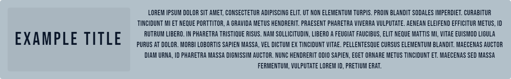 | 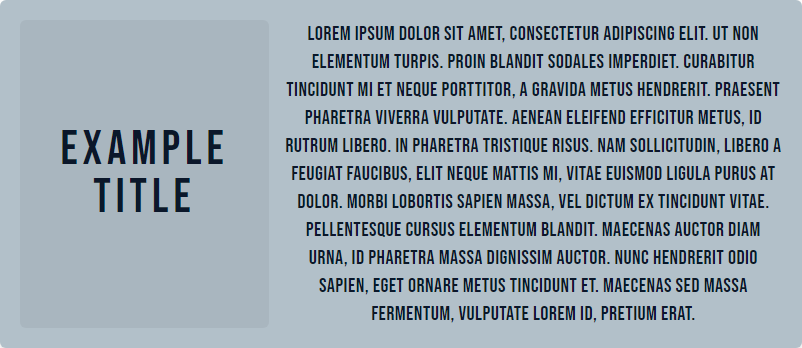 | 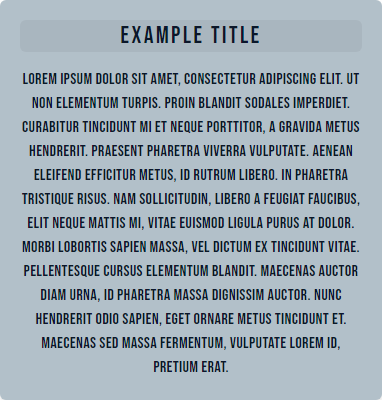 |

An exemplar of usage leveraging the `getDataContent` prop includes:

    import Article, { ArticleProps } from './your-path'
    
    const YourComponent = () => {
      const fetchDataContent = async () => {
        return new Promise<ArticleData>((resolve) => {
          setTimeout(() => {
            resolve({
              title: 'Example Title',
              body: `Lorem ipsum dolor sit amet, consectetur adipiscing elit. Ut non elementum turpis. Proin blandit 
                      sodales imperdiet. Curabitur tincidunt mi et neque porttitor, a gravida metus hendrerit. Praesent pharetra 
                      viverra vulputate. Aenean eleifend efficitur metus, id rutrum libero. In pharetra tristique risus. 
                      Nam sollicitudin, libero a feugiat faucibus, elit neque mattis mi, vitae euismod ligula purus at dolor. 
                      Morbi lobortis sapien massa, vel dictum ex tincidunt vitae. Pellentesque cursus elementum blandit. 
                      Maecenas auctor diam urna, id pharetra massa dignissim auctor. Nunc hendrerit odio sapien, eget ornare metus 
                      tincidunt et. Maecenas sed massa fermentum, vulputate lorem id, pretium erat.`,
            });
          }, 1500);
        });
      };

    return <Article className={'w-full'} getDataContent={fetchDataContent} />;
    
    export default YourComponent;

## Form

This component showcases a form consisting of a call to action (CTA), name, email, subject, message,
and button child components whose styles adapt to the positive or negative contrast polarities
(Either light or dark mode) of a system's display.

You can add your styles to its MUI input by including them inside the
`customTextField.ts` or modify the existing ones at your description.

|                           Desktop View                            |                           Tablet View                           |                           Mobile View                           |
|:-----------------------------------------------------------------:|:---------------------------------------------------------------:|:---------------------------------------------------------------:|
| 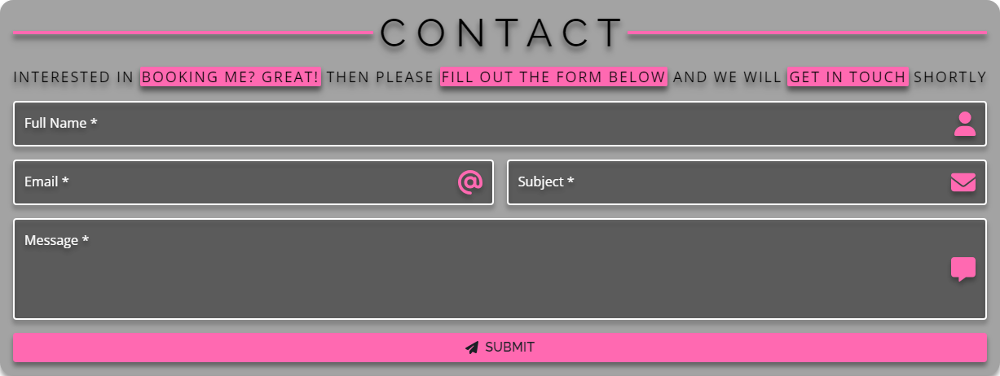 | 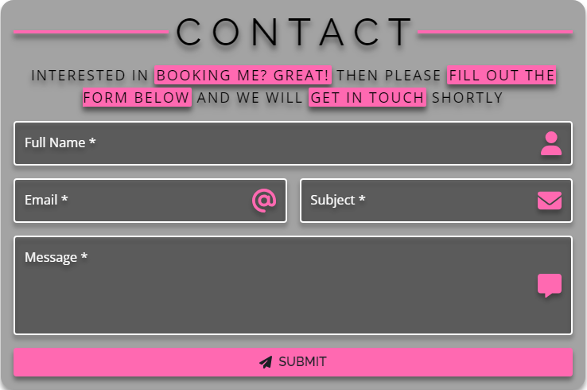 | 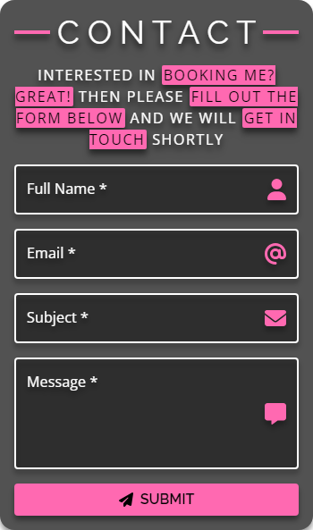 |

An exemplar of usage includes:

    import Form from './your-path';
    
    const YourComponent = () => {
      return <Form />
    };
    
    export default YourComponent;

## Navigation

This component showcases a navigation bar that includes a logo, menu items,
and social media logo child components
whose styles adapt to the positive or negative contrast polarities
(Either light or dark mode) of a system's display.

|                                    Desktop View                                     |                                    Tablet View                                    |                                    Mobile View                                    |
|:-----------------------------------------------------------------------------------:|:---------------------------------------------------------------------------------:|:---------------------------------------------------------------------------------:|
| 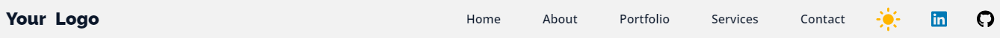 | 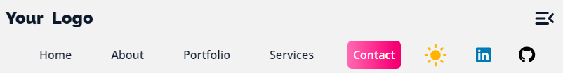 | 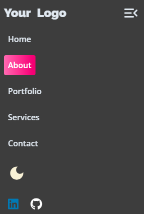 |

An exemplar of usage includes:

    import Navigation from './your-path';
    
    const YourComponent = () => {
      return <Navigation />
    };
    
    export default YourComponent;

## Section Menu

This component showcases an in-page navigation menu
whose styles adapt to the positive and negative contrast polarities
(Either light or dark mode) of a system's display.

|                                       Desktop View                                        |                                       Tablet View                                       |                                       Mobile View                                       |
|:-----------------------------------------------------------------------------------------:|:---------------------------------------------------------------------------------------:|:---------------------------------------------------------------------------------------:|
|  | 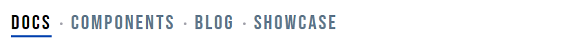 | 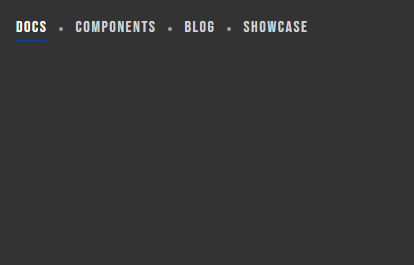 |

An exemplar of usage includes:

      import SectionMenuItem, { SectionMenuItemRecord } from './your-path';

      const YourComponent = () => {
        const handleOnClick = (clickedItem: SectionMenuItemRecord) => {
          console.log('Clicked SectionMenuItem:', clickedItem);
        };
        
        const items: SectionMenuItemRecord[] = [
          { anchor: 'section-one', label: 'SectionOne' },
          { anchor: 'section-two', label: 'SectionTwo' },
        ];
        
        return (
          <>
            {items.map((item) => (
              <SectionMenuItem item={item} key={item.anchor} onClick={handleOnClick} />
            ))}
          </>
        );
      };
      
      export default YourComponent;

## Button

This component showcases a button inspired by MUI's
that includes several variants and colors
whose styles adapt to the positive or negative contrast polarities
(Either light or dark mode) of a system's display.

You can add your styles
by including them inside the `variantTypesStyles.ts` and `rippleTypesStyles.ts`,
respectively or collectively,
or modify the existing ones at your description.

|                      Text                       |                         Contained                         |                        Outlined                         |
|:-----------------------------------------------:|:---------------------------------------------------------:|:-------------------------------------------------------:|
| 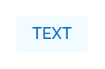 | 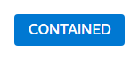 | 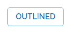 |

An exemplar of usage includes:

    import { MouseEvent } from 'react';

    import Button from './your-path';
    
    const handleOnClickPlaceholder = (event: MouseEvent): void => event.preventDefault();
    
    const YourComponent = () => {
      return (
        <Button
          color={'success'}
          disableRipple={true}
          onClick={handleOnClickPlaceholder}
          size={'large'}
          variant={'contained'}
        >
          Click Me
        </Button>
      );
    };
    
    export default YourComponent;

And if you need to interact with the button's DOM element directly,
you can leverage the `ref` prop:

    import { useRef } from 'react';

    import Button from './your-path';
    
    const YourComponent = () => {
      const handleRef = useRef(null);
  
      const handleOnClick = () => {
        if (handleRef.current) {
        handleRef.current.style.backgroundColor = '#1976D2';
        }
      };

      return (
        <Button onClick={handleOnClick} ref={handleRef}>
            Click Me
        </Button>
      );
    };

    export default YourComponent;

## Card

This component showcases a card whose styles adapt to the positive or negative contrast polarities
(Either light or dark mode) of a system's display.

|                           Desktop View                            |                           Tablet View                           |                           Mobile View                           |
|:-----------------------------------------------------------------:|:---------------------------------------------------------------:|:---------------------------------------------------------------:|
| 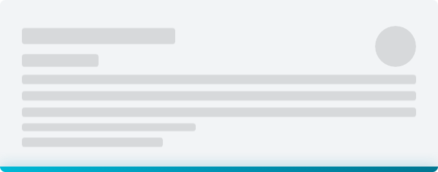 | 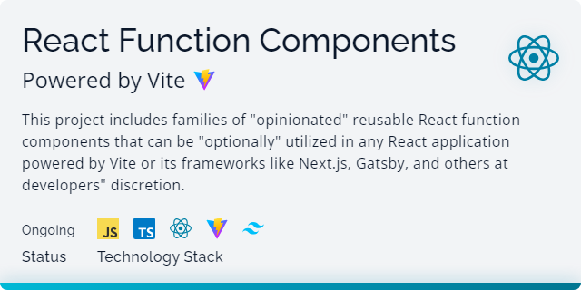 | 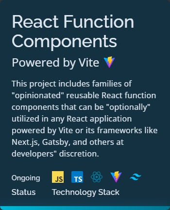 |

An exemplar of usage leveraging the `getDataContent` prop from a personal project includes:

    import Card, { CardData } from 'ui/Card/Card';
    import MyWebsiteFrontEnd from 'TechStack/MyWebsiteFrontEnd';
    import getCFDBaseURL from 'config/getCFDBaseURL.config';

    const YourComponent = () => {
      const fetchDataContent = async (): Promise<CardData> => {
        return new Promise<CardData>((resolve) => {
          setTimeout(() => {
            resolve({
              heading: {
                heading: 'drop-shadow-[0_0px_10px_rgba(219,112,147,1)] sm:drop-shadow-none',
                heading: 'mdjohnson.dev',
                href: 'https://github.com/MichaelJohnson144/mdjohnson.dev',
              },
              subHeading: {
                alt: 'Next.js',
                href: 'https://nextjs.org',
                src: getCFDBaseURL('/assets/images/next.js-logomark.svg'),
                subHeading: 'Powered by Next.js',
              },
              image: {
                alt: '',
                href: 'https://github.com/MichaelJohnson144/mdjohnson.dev',
                src: '',
                heading: 'M.D.Johnson.dev',
                className: 'font-amsterdam-four drop-shadow-[0_0px_10px_rgba(219,112,147,1)]',
              },
              body: {
                paragraph: `This project presents my e-portfolio, which exhibits the culmination of my 
                            experiences in a space that aesthetically showcases and sells my talent in 
                            a room on the internet.`,
              },
              descriptionList: {
                description: 'Status',
                details: 'Ongoing',
                subDescription: 'Technology Stack',
                subDetails: <MyWebsiteFrontEnd />,
              },
            });
          }, 1500);
        });
      };
      
      return (
        <Card
          className={'bg-[#FFF1FA]/70 drop-shadow-[0_0px_10px_rgba(219,112,147,0.6)]'}
          getDataContent={fetchDataContent}
          spanClassName={'from-pink-400 via-pink-600 to-pink-800'}
        />
      );
    };
    
    export default YourComponent;

## Input

This component showcases an input
that includes several variants and colors whose styles adapt to the contrast polarity
(Either light or dark mode) of a system's display,
including a `multiline` prop that transforms its text field into a `<textarea>` element.

You can add your styles by including them inside the `inputStyles.ts` and `labelStyles.ts`,
respectively or collectively,
or modify the existing ones at your description.

|                            Input                            |                                Textarea                                |
|:-----------------------------------------------------------:|:----------------------------------------------------------------------:|
| 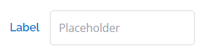 | 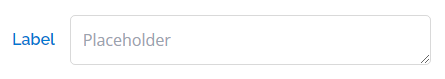 |

An exemplar of usage includes:

    import { ChangeEvent } from 'react';

    import Input from './your-path';
    
    const handleOnChangePlaceholder = (event: ChangeEvent): void => event.preventDefault();
    
    const YourComponent = () => {
      return (
        <Input
          label={'Enter your name'}
          onChange={handleOnChangePlaceholder}
          placeholder={'John Doe'}
        />
      );
    };
    
    export default YourComponent;

And if you need to convert the component into a Textarea,
add the `multiline` prop and set it to `true`.

## Theme Toggler

This component showcases a theme-toggler that can switch the contrast polarity of a system's display
between light or dark mode.

|                                   Light Mode                                   |                                  Dark Mode                                   |
|:------------------------------------------------------------------------------:|:----------------------------------------------------------------------------:|
| 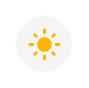 |  |

An exemplar of usage includes:

    import ThemeToggler from './your-path';

    const YourComponent = () => {
      return <ThemeToggler />
    };
    
    export default YourComponent;
