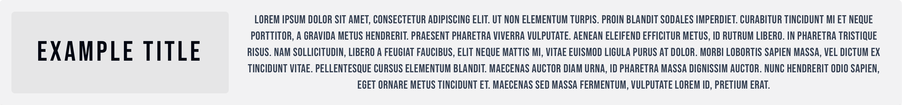
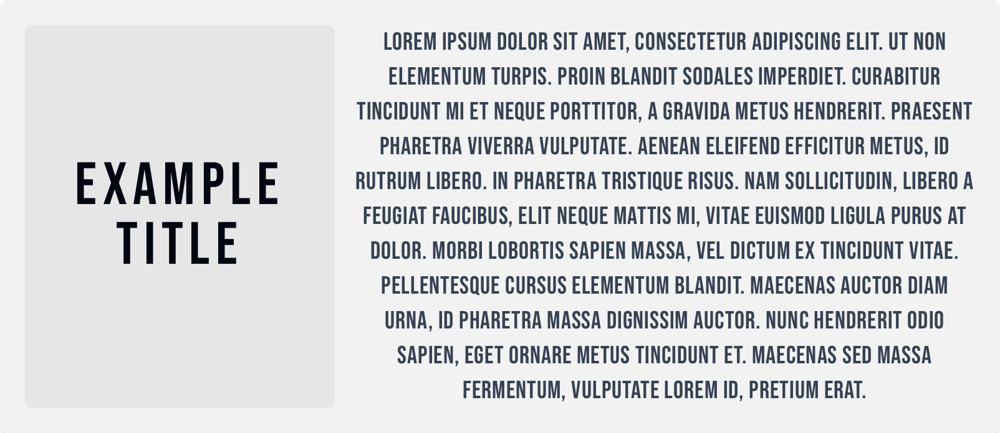
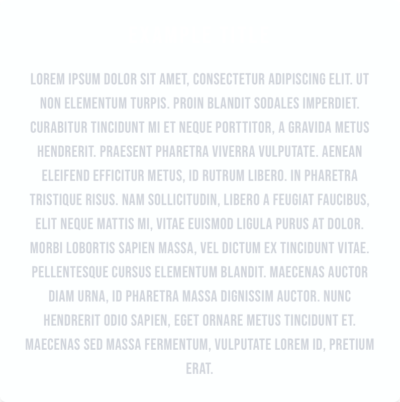
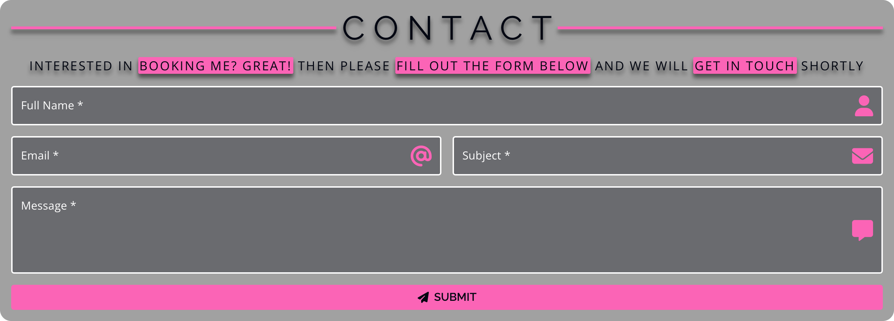
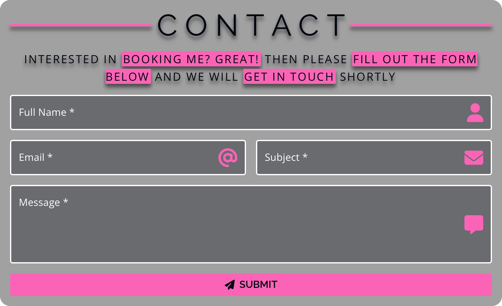
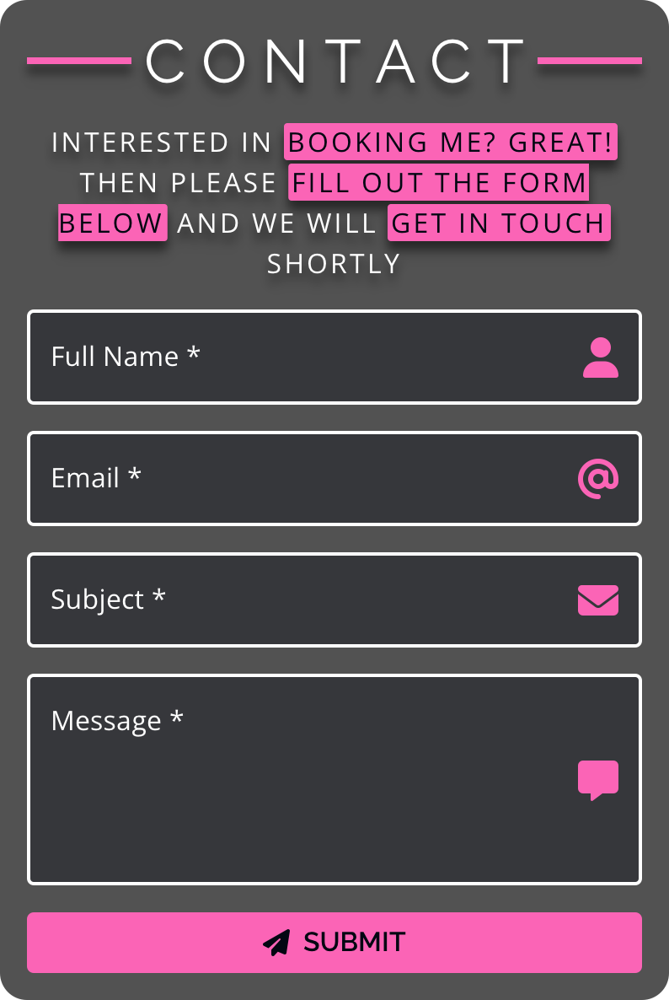
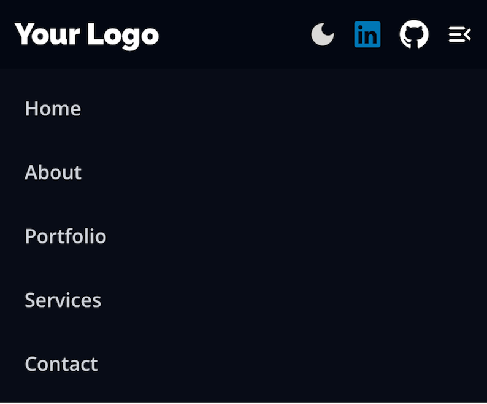

<div align="center">
  <section>
    <a href="https://vite.dev/">
      <picture>
        <source media="(prefers-color-scheme: dark)" srcset="https://vite.dev/logo.svg" />
        
      </picture>
    </a>
    <a href="https://react.dev/">
      <picture>
        <source media="(prefers-color-scheme: dark)" srcset="public/react-logomark.svg" />
        
      </picture>
    </a>
    <h1>React Function Components</h1>
  </section>
</div>

## Article

This component showcases a default and async article comprised of a body and title whose styles adapt to the contrast
polarity of an operating system's (OS's) display.

|                                Desktop View                                |                               Tablet View                                |                               Mobile view                                |
|:--------------------------------------------------------------------------:|:------------------------------------------------------------------------:|:------------------------------------------------------------------------:|
|  |  |  |

An exemplar of usage leveraging the `getDataContent` prop includes:

```tsx
import Article, { type ArticleData } from '@/ui/Article/Article';

const YourComponent = () => {
  const delay = (ms: number): Promise<void> => new Promise((resolve) => setTimeout(resolve, ms));

  const fetchDataContent = async (): Promise<ArticleData> => {
    await delay(1500);
    return {
      title: 'Example Title',
      body: `Lorem ipsum dolor sit amet, consectetur adipiscing elit. Ut non elementum turpis. Proin blandit
             sodales imperdiet. Curabitur tincidunt mi et neque porttitor, a gravida metus hendrerit. Praesent pharetra
             viverra vulputate. Aenean eleifend efficitur metus, id rutrum libero. In pharetra tristique risus.
             Nam sollicitudin, libero a feugiat faucibus, elit neque mattis mi, vitae euismod ligula purus at dolor.
             Morbi lobortis sapien massa, vel dictum ex tincidunt vitae. Pellentesque cursus elementum blandit.
             Maecenas auctor diam urna, id pharetra massa dignissim auctor. Nunc hendrerit odio sapien, eget ornare metus
             tincidunt et. Maecenas sed massa fermentum, vulputate lorem id, pretium erat.`,
    };
  };

  return <Article getDataContent={fetchDataContent} className={'w-full'} />;
};

export default YourComponent;
```

## Form

This component showcases a form consisting of a call to action, name, email, subject, message, and button child
components whose styles adapt to the contrast polarity of an OS's display.

You can add your styles to its MUI input by including them inside the `customTextField.ts` or modify the existing ones
at your discretion.

|                           Desktop View                            |                           Tablet View                           |                           Mobile View                           |
|:-----------------------------------------------------------------:|:---------------------------------------------------------------:|:---------------------------------------------------------------:|
|  |  |  |

An exemplar of usage includes:

```tsx
import Form from '@/components/Form/Form';

const YourComponent = () => {
  return <Form />;
};

export default YourComponent;
```

## Navigation

This component showcases a navigation bar that includes your logo, menu items, theme toggler, and social media logomark
child components whose styles adapt to the contrast polarity of an OS's display.

|                                    Desktop View                                     |                                    Tablet View                                    |                                    Mobile View                                    |
|:-----------------------------------------------------------------------------------:|:---------------------------------------------------------------------------------:|:---------------------------------------------------------------------------------:|
|  |  |  |

An exemplar of usage includes:

```tsx
import Navigation from '@/components/Navigation/Navigation';

const YourComponent = () => {
  return <Navigation />;
};

export default YourComponent;
```

## Section Menu

This component showcases an in-page navigation menu whose styles adapt to the contrast polarity of an OS's display.

|                                       Desktop View                                        |                                       Tablet View                                       |                                       Mobile View                                       |
|:-----------------------------------------------------------------------------------------:|:---------------------------------------------------------------------------------------:|:---------------------------------------------------------------------------------------:|
|  |  |  |

An exemplar of usage includes:

```tsx
import type { SectionMenuItemRecord } from '@/components/SectionMenu/SectionMenuItem/SectionMenuItem';
import SectionMenu from '@/components/SectionMenu/SectionMenu';

const YourComponent = () => {
  const menuItems: SectionMenuItemRecord[] = [
    { anchor: 'docs', label: 'Docs' },
    { anchor: 'components', label: 'Components' },
    { anchor: 'blog', label: 'Blog' },
    { anchor: 'showcase', label: 'Showcase' }
  ];

  const handleMenuChange = (item: SectionMenuItemRecord) => {
    console.log('Selected menu item:', item);
  };

  return <SectionMenu items={menuItems} onChange={handleMenuChange} selectedAnchor={'docs'} />;
};

export default YourComponent;
```

## Button

This component showcases a button inspired by MUI that includes several variants and colors whose styles adapt to the
contrast polarity of an OS's display.

You can add your styles by including them inside the `typeStyles.ts` and `rippleTypesStyles.ts`, respectively or
collectively, or modify the existing ones at your discretion.

|                      Text                       |                         Contained                         |                        Outlined                         |
|:-----------------------------------------------:|:---------------------------------------------------------:|:-------------------------------------------------------:|
|  |  |  |

An exemplar of usage includes:

```tsx
import { type MouseEvent } from 'react';

import Button from '@/components/Button/Button';

const handleOnClickPlaceholder = (event: MouseEvent): void => event.preventDefault();

const YourComponent = () => {
  return (
    <Button
      onClick={handleOnClickPlaceholder}
      disableRipple={true}
      variant={'contained'}
      color={'success'}
      size={'large'}
    >
      Click Me
    </Button>
  );
};

export default YourComponent;
```

And if you need to interact with the button's DOM element directly, you can leverage the `ref` prop:

```tsx
import { useRef } from 'react';

import Button from '@/components/Button/Button';

const YourComponent = () => {
  const handleRef = useRef(null);

  const handleOnClick = () => {
    if (handleRef.current) {
      handleRef.current.style.backgroundColor = '#1976D2';
    }
  };

  return (
    <Button onClick={handleOnClick} ref={handleRef}>
      Click Me
    </Button>
  );
};

export default YourComponent;
```

## Card

This component showcases a card whose styles adapt to the contrast polarity of an OS's display.

|                           Desktop View                            |                           Tablet View                           |                           Mobile View                           |
|:-----------------------------------------------------------------:|:---------------------------------------------------------------:|:---------------------------------------------------------------:|
|  |  |  |

An exemplar of usage leveraging the `getDataContent` prop from a personal project includes:

```tsx
import Card, { type CardData } from '@/components/ui/Card/Card';
import FrontEnd from '@/components/ui/Card/Contents/FrontEnd';

const YourComponent = () => {
  const delay = (ms: number): Promise<void> => new Promise((resolve) => setTimeout(resolve, ms));
  const fetchDataContent = async (): Promise<CardData> => {
    await delay(1500);

    return {
      heading: {
        heading: 'React Function Components',
        href: 'https://github.com/MichaelJohnson144/react-function-components',
      },
      subHeading: {
        subHeading: 'Powered by Vite',
        href: 'https://vite.dev/',
        alt: 'Vite',
        src: 'https://vite.dev/logo.svg',
      },
      image: {
        href: 'https://react.dev/',
        alt: 'React',
        src: '/react-logomark.svg',
      },
      body: {
        paragraph: `This project includes families of "opinionated" reusable React function components that can be 
                    "optionally" utilized in any React applications powered by Vite or its meta-frameworks, like 
                    Next.js, Astro, Nuxt, SvelteKit, Remix, Gatsby, and others at developers' discretion.`,
      },
      descriptionList: {
        description: 'Status',
        details: 'Ongoing',
        subDescription: 'Technology Stack',
        subDetails: <FrontEnd />,
      },
    };
  };

  return (
    <Card
      getDataContent={fetchDataContent}
      className={'bg-[#002F4D]/5 p-8 backdrop-blur sm:max-w-screen-sm dark:bg-[#002F4D]/60'}
      spanClassName={'from-cyan-500 via-cyan-600 to-cyan-700 drop-shadow-[0_0px_10px_rgba(8,126,164,0.4)]'}
    />
  );
};

export default YourComponent;
```

## Input

This component showcases an input that includes several variants and colors whose styles adapt to the contrast
polarity of an OS's display, including a `multiline` prop that transforms its text field into a `<textarea>` element.

You can add your styles by including them inside the `inputStyles.ts` and `labelStyles.ts`, respectively or
collectively, or modify the existing ones at your discretion.

|                            Input                            |                                Textarea                                |
|:-----------------------------------------------------------:|:----------------------------------------------------------------------:|
|  |  |

An exemplar of usage includes:

```tsx
import { type ChangeEvent } from 'react';

import Input from '@/components/Input/Input';

const handleOnChangePlaceholder = (event: ChangeEvent): void => event.preventDefault();

const YourComponent = () => {
  return <Input label={'Enter your name'} placeholder={'John Doe'} onChange={handleOnChangePlaceholder} />;
};

export default YourComponent;
```

And if you need to convert the component into a Textarea, add the `multiline` prop and set it to `true`.

## Theme Toggler

This component showcases a theme-toggler that switches between the contrast polarity of an OS's display.

|                                   System Mode                                    |                                   Light Mode                                   |                                  Dark Mode                                   |
|:--------------------------------------------------------------------------------:|:------------------------------------------------------------------------------:|:----------------------------------------------------------------------------:|
|  |  |  |

An exemplar of usage includes:

```tsx
import ThemeToggler from '@/components/ThemeToggler/ThemeToggler';

const YourComponent = () => {
  return <ThemeToggler />;
};

export default YourComponent;
```
